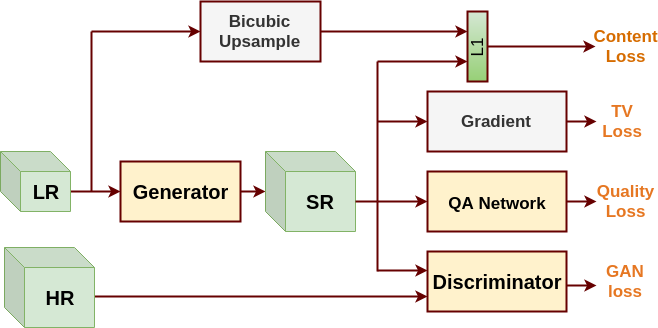
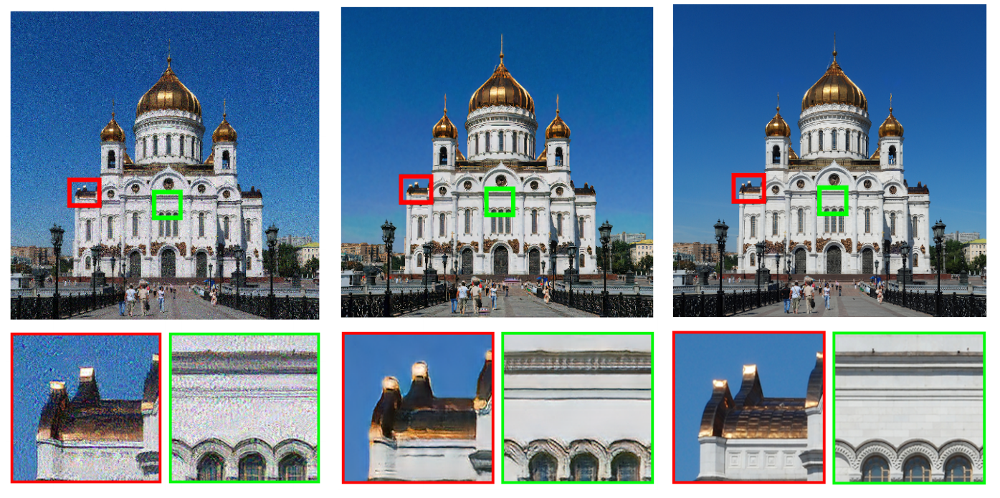
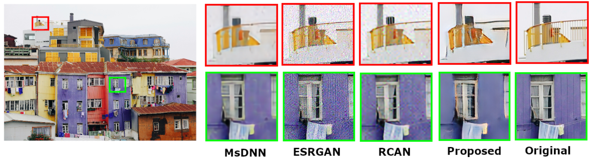
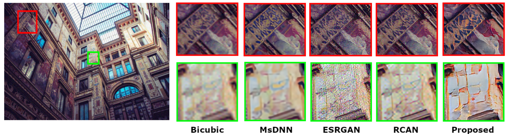
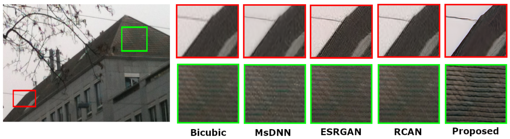

# Unsupervised Single Image Super-Resolution Network (USISResNet) for Real-World Data Using Generative Adversarial Network

This is repository of code for NTIRE-2020 (CVPRW-2020) paper titled ["Unsupervised Single Image Super-Resolution Network (USISResNet) for Real-World Data Using Generative Adversarial Network"](https://openaccess.thecvf.com/content_CVPRW_2020/papers/w31/Prajapati_Unsupervised_Single_Image_Super-Resolution_Network_USISResNet_for_Real-World_Data_Using_CVPRW_2020_paper.pdf)

**- Framework description**



**- Results**







To test/reproduce results, change `option/test/test_ntire1.json` file in which you need to change path for dataset and pre-trained model of G network.
Then you need run following command.
```javascript
python test.py -opt option/test/test_ntire1.json
```

**- Pre-trained model**
- The pre-train model is shared in main folder named "11600_G.pth" for USISResNet.
- The pre-trained model for QA assessment network trained on KADID dataset as mentioned in the manuscript has also be included as "latest_G.pth".

Required Packages.
pytorch 1.4
opencv 3.4.2
python-lmdb 0.96

We are thankful to Xinntao for their ESRGAN code on which we have made this work.
(https://github.com/xinntao/ESRGAN)
